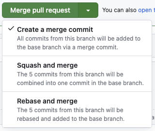
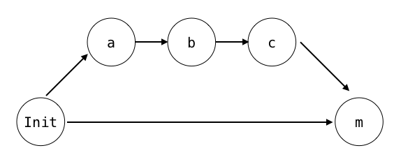
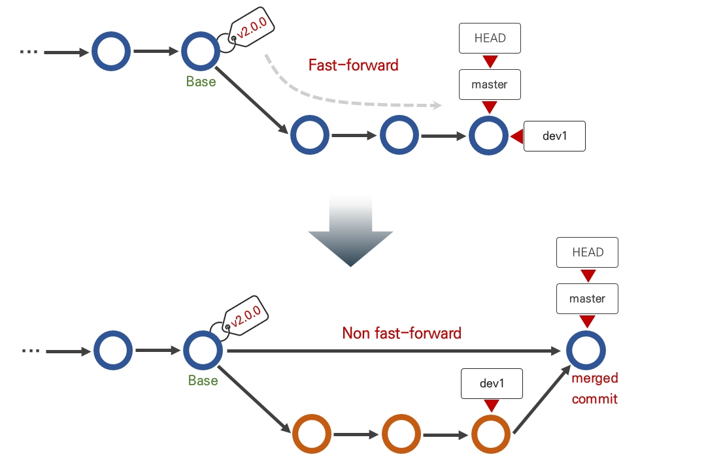
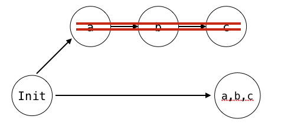
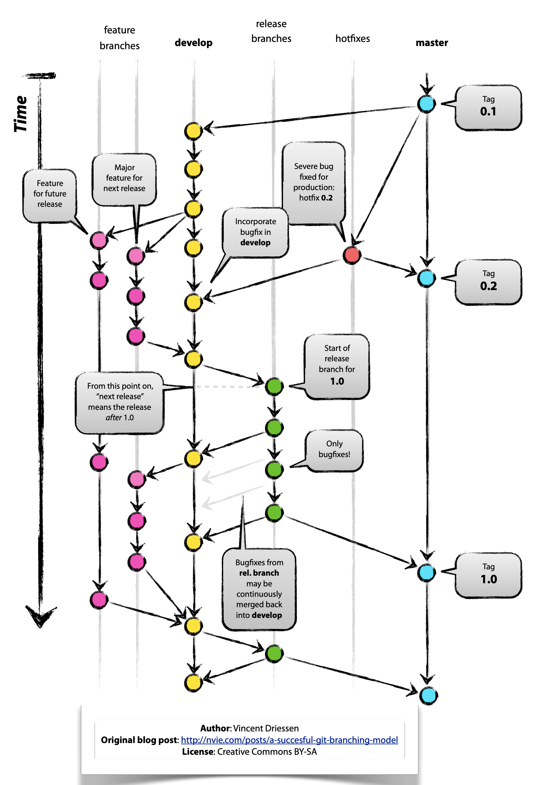

### ✅ Git이란 무엇인가요?

Git은 분산 버전 관리 시스템으로, 코드 및 파일의 변경 이력을 관리하고 협업을 용이하게 하는 도구입니다. Git은 개발자가 프로젝트의 모든 버전을 기록하고, 수정 사항을 추적하며, 여러 사람이 동시에 작업할 수 있도록 도와줍니다.

#### Git의 기본 개념과 버전 관리 시스템으로서의 역할

- **버전 관리**: Git은 파일의 변경 이력을 저장하여, 이전 버전으로 되돌리거나 특정 변경 사항을 쉽게 추적할 수 있게 합니다.
- **분산 시스템**: 각 개발자는 자신의 로컬 저장소에서 작업하며, 변경 사항을 원격 저장소와 동기화하여 협업합니다.

### ✅ Git과 SVN의 차이점은 무엇인가요?

| 특징          | Git                                 | SVN                              |
| ------------- | ----------------------------------- | -------------------------------- |
| **구조**      | 분산형                              | 중앙집중형                       |
| **성능**      | 빠른 커밋과 브랜치 생성             | 큰 파일 처리 시 느릴 수 있음     |
| **작업 방식** | 로컬에서 완전한 이력 관리           | 서버에 의존하여 변경 사항 관리   |
| **장점**      | 오프라인 작업 가능, 효율적인 브랜칭 | 간단한 사용법, 중앙 관리         |
| **단점**      | 복잡한 커맨드와 초기 학습 곡선      | 서버 장애 시 모든 작업 중단 가능 |

### ✅ Git의 상태(state)란 무엇인가요?

Git의 상태는 파일이 현재 어떤 단계에 있는지를 나타냅니다. 주요 상태로는 Working Directory, Staging Area, Repository가 있습니다.

- Working Directory: 현재 작업 중인 파일들이 존재하는 공간
- Staging Area: 커밋할 변경 사항을 준비하는 공간
- Repository: 모든 커밋 이력과 버전 정보를 저장하는 공간

### ✅ Git에서 branch merge 방법들과 각 방법의 특징을 설명해 주세요.

#### 📘branch merge란

현재 branch에서 다른 branch를 합칠 때 사용한다.

특정 branch로 합치게 해달라고 요청하는 pr(pull request)에도 아래와 같이 세 가지 merge 방법 중 하나를 선택할 수 있다.

#### 📘merge

- 일반적으로 많이 사용하는 merge 방법이며, 커밋 이력을 모두 남길 때 사용한다.
- 장점이자 단점은 모든 커밋과 분기했던 branch 히스토리가 남는다는 점.

#### 📘Fast-forward 설정이란?

- git merge 는 —ff 옵션(fast-forward)이 기본으로 설정되어 있는데, 이는 Base 브랜치가 이후 변경 내용이 없는 최신 브랜치일 경우 병합한다는 커밋 없이 합치고, 그렇지 않을 경우 병합 커밋을 남기고 합친다.
- Github의 Merge pull request는 git merge -—no-ff 옵션으로 Base 브랜치가 최신 브랜치라 할지라도 커밋을 남기도록 강제한다.

#### 📘Squash & Merge

- git merge 에 -squash 옵션을 추가한 방법
  분기했던 branch에 있던 내용 a, b, c 커밋을 모두 합쳐 하나의 새로운 커밋을 만든다.
- 지저분한 커밋 히스토리들을 하나로 합쳐서, 기능상 의미있는 하나의 커밋만 남길 때 사용한다.
- 잘못 사용해 과도한 생략을 하게 되면, 추후 변경 파악이 힘들 수 있다.

#### 📘Rebase & Merge

- 분기했던 branch의 기준을 최신 Base로 설정하고, merge하는 방법. 결과적으로는 git merge -ff 와 같은 형태가 된다.
- rebase를 하면 커밋들의 Base가 변경돼 커밋 해시 또한 변경 될 수 있다. 이런 경우 git push -f (force push)해야할 경우도 있다.
- 머지 커밋을 남길 필요가 없는 merge의 경우 사용하면 좋다.
- 커밋 그래프가 하나의 라인으로 그려져 가독성에 좋다.

> ### 언제 어떤 걸 사용할까?  
>
> - 특정 기능 개발 후 develop branch에 merge하고자 할 때는 Squash and Merge가 유용할 수 있다.
> - develop branch를 production branch로 merge하고자 할 때는 develop branch에 분기가 남아있다면, production branch는 간결하게 유지하고자 Rebase and Merge가 유용할 수 있다.

### ✅ 리베이스(rebase)와 머지(merge)의 차이점은 무엇인가요?

- 리베이스: 현재 브랜치의 변경 사항을 다른 브랜치의 가장 최신 커밋 위로 재배치합니다. `깔끔한 히스토리, 선형적 기록 복잡한 충돌 처리 가능`
- 머지: 두 브랜치를 병합하여 새로운 커밋을 생성합니다.`간단한 병합, 모든 히스토리 보존 복잡한 히스토리, 많은 머지 커밋`

### ✅ Git Flow 브랜치 전략에 대해 설명해 주세요.

Git flow는 main 또는 master 브랜치와 development 브랜치를 유지하면서, 용도에 따라 임시적으로 feature, release, hotfix 브랜치를 생성해서 사용하는 방식의 전략

### 💡 master:

- 정식 배포의 기준이 되는 브랜치로, 항상 안정적인 제품이 서비스될 수 있는 소스코드이며, 언제나 배포가능한상태로 유지되어야 하는 브랜치

### 💡 develop:

- 개발 중인 코드를 관리하는 브랜치
- 새로운 기능 개발과 개발된 변화를 담은 버전 배포작업이 시작될 수 있는 브랜치
- develop은 master를 기준으로 변화가 일어나는 브랜치이고, 준비가 되면 쌓여온 변화들이 master에 병합시키기 위한 브랜치라는 것. 새 버전이 배포되는 시점만큼은 master 브랜치와 동일한 상태일 것이다.

### 💡 feature:

- 개발할 기능을 위한 브랜치
- 기능 개발이 완료되면 그 변화가 develop 브랜치로 병합하고, feature브랜치는 제거된다.

### 💡 release:

- 배포를 위한 브랜치
- 배포 전 마무리 작업과 버그 수정이 이루어진다.
  완료되면 master와 develop 브랜치로 병합된다. 역시 릴리즈가 끝나면 제거된다.
- 추가로, master 브랜치에 긴급한 수정이 필요할 때는, hotfix 브랜치를 활용해서 빠르게 배포하기도 한다.

### 💡 hotfix:

- 긴급한 버그 수정을 위한 브랜치
- master 브랜치에서 발생한 버그를 고치고 master와 develop 브랜치로 병합한다.
- master브랜치를 기준으로 생성하기 때문에, 빠르게 master에 병합해서 버그에 대응할 수 있다.

> Git flow는 안정적인 코드 배포를 위한 강력한 전략이지만, 프로젝트가 작을 때는 비효율적일 수 있다. 배포주기가 긴 대형 서비스이면서, 서비스의 안정성이 강조되는 경우에 좋은 전략이 될 수 있다.  
> 📗장점
>
> - 안정적인 배포를 위한 구조가 갖춰져 있다.
> - 긴 개발 주기에 적합하며, 복잡한 기능 개발과 버그 수정에 유용하다.
> - 배포 전 마무리 작업과 테스트를 위한 release 브랜치를 사용할 수 있다. 
>
> 📗단점
>
> - 브랜치가 많아지고 관리해야 할 작업이 증가할 수 있다.
> - 작은 규모의 프로젝트에서는 비효율적일 수 있다.
