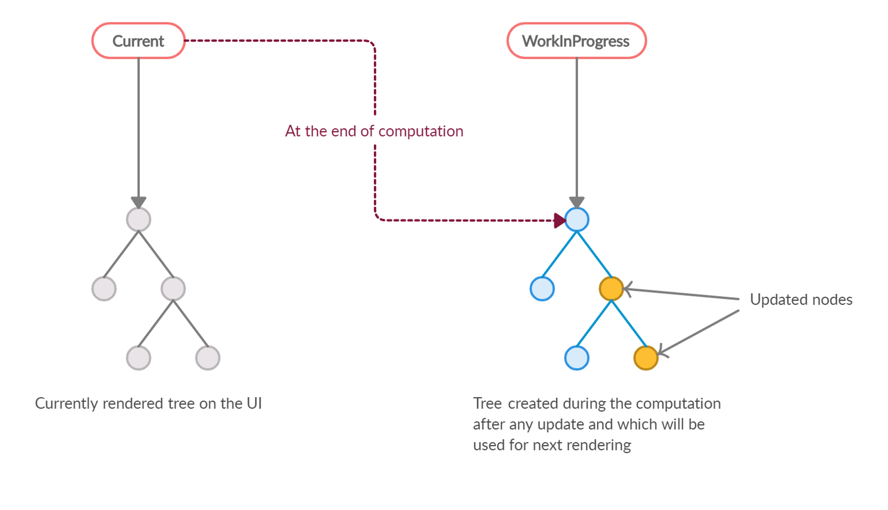
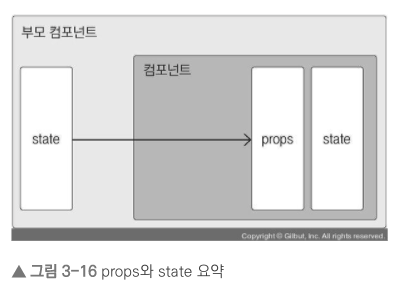
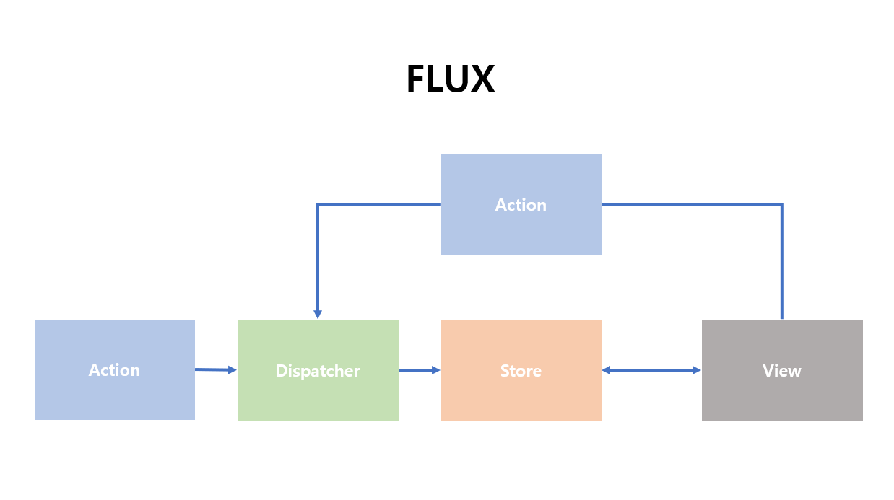
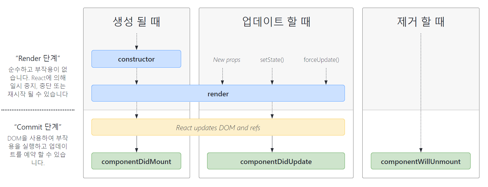

### ✅ 리액트는 라이브러리인가요 프레임워크인가요?

리액트는 **라이브러리**입니다. UI 구성 요소를 만들기 위한 도구로, 특정한 방법론이나 아키텍처를 강제하지 않고 필요한 부분만 선택하여 사용할 수 있습니다.

### 💡라이브러리와 프레임워크의 차이

| 구분      | 라이브러리                       | 프레임워크                               |
| --------- | -------------------------------- | ---------------------------------------- |
| 정의      | 특정 기능을 수행하는 코드 집합   | 애플리케이션의 구조를 제공하는 코드 집합 |
| 사용 방식 | 호출하여 사용                    | 프레임워크에 맞춰 코드를 작성            |
| 제어 흐름 | 호출하는 쪽에서 제어 흐름을 관리 | 프레임워크가 제어 흐름을 관리            |
| 유연성    | 더 높은 유연성 제공              | 일정한 규칙과 구조가 필요                |
| 재사용성  | 특정 기능을 재사용하기 용이      | 전체 구조를 재사용하기 용이              |
| 예시      | jQuery, Lodash                   | Angular, Django                          |

> 프레임워크는 Application 개발시 코드의 품질, 필수적인 코드, 알고리즘, 암호화, 데이터베이스 연동 같은 기능들을 어느정도 구성이 되어있는 뼈대(구조)를 제공하도록 만들어진 것. 개발 구조나 설계 시 제공되는 인터페이스의 집합입니다. 완성된 어플리케이션은 아니지만 어느정도 프로그래머가 제공된 프레임워크의 구조에서 어플리케이션을 개발해야합니다.

> 라이브러리는 특정 기능에 대한 API(도구 / 함수)를 모은 집합

### ✅ 리액트를 사용하는 이유

- **컴포넌트 기반**: UI를 독립적인 컴포넌트로 나눌 수 있어 재사용성과 관리성이 높습니다.
- **가상 DOM**: 변경된 부분만 업데이트하여 성능을 최적화합니다.
- **단방향 데이터 흐름**: 데이터의 흐름을 명확하게 관리할 수 있어 유지보수가 용이합니다.
- **SPA(싱글 페이지 애플리케이션)**: 서버의 자원을 아낄 수 있다. + 더 좋은 사용자 경험을 누릴 수 있다.

> - component를 사용해서 유지보수가 용이 (필요한 부분의 component만 렌더링 된다. 최적화된 렌더링이 가능)
> - 생태계가 넓고, 다양한 라이브러리 사용 가능
> - virtual DOM을 활용하여 빠른 렌더링이 가능
> - 리액트 네이티브를 활용하여 앱 개발 가능

### ✅ Virtual DOM에 대해서 아나요?

`HTTP response > DOM tree > CSSOM tree > render tree > painting`
DOM은 새로운 요청이 있으면 위와 같은 형태를 거쳐 리렌더링을 하게 된다. DOM의 속도는 느리지 않다. 하지만 매번 새롭게 구성하기 때문에, 양이 엄청 많으면 분명 퍼포먼스가 떨어질 것이다.

Virtual DOM은 실제 DOM의 가벼운 복사본입니다. 리액트는 상태 변경 시 가상 DOM에서 업데이트를 먼저 처리한 후, 실제 DOM과 비교하여 변경된 부분만을 효율적으로 업데이트합니다.

### 💡 DOM과 Virtual DOM의 차이

| 특성                          | DOM             | Virtual DOM                                                         |
| ----------------------------- | --------------- | ------------------------------------------------------------------- |
| 업데이트                      | 느림            | 빠름                                                                |
| 메모리                        | 낭비 심함       | 낭비 덜함                                                           |
| 새로운 엘리먼트 업데이트 방식 | 새로운 DOM 생성 | 가상 DOM 생성 후 이전 가상 DOM과 비교 후 바뀐 부분만 DOM에 업데이트 |

### ✅ 리액트의 렌더링에 대해 아나요?

리액트 렌더링은 컴포넌트의 상태나 props가 변경될 때 UI를 업데이트하는 과정을 말합니다. 이 과정에서 Virtual DOM을 사용하여 최적화된 방식으로 DOM 업데이트를 수행합니다.

### ✅ 리액트 파이버에 대해서 아나요?

리액트 파이버는 리액트의 새로운 재조정 엔진으로, 렌더링을 더욱 효율적으로 처리하기 위해 도입되었습니다. 비동기 렌더링을 지원하여 사용자 경험을 향상시킵니다.

### ✅ 리액트 파이버 트리

파이버 트리는 컴포넌트의 계층 구조를 나타내며, 각 컴포넌트의 상태와 정보를 포함합니다. 파이버는 렌더링 중 비동기 작업을 관리하고 중단 및 재개할 수 있는 기능을 제공합니다.

### ✅ 리액트 파이버와 DOM, Virtual DOM의 관계

- **Virtual DOM**: 변경된 UI를 메모리에서 표현한 것.
- **파이버**: Virtual DOM의 구조를 관리하며, 비동기 업데이트를 가능하게 함.
- **DOM**: 실제 웹 페이지에서 렌더링되는 구조. 파이버가 Virtual DOM의 변화를 실제 DOM에 반영합니다.

### ✅ 렌더 단계와 커밋 단계에 대해 아나요?

- **렌더 단계**: 컴포넌트를 Virtual DOM으로 변환하고, 변경된 내용을 계산합니다.
- **커밋 단계**: 계산된 변경 사항을 실제 DOM에 반영합니다.

### ✅ React에서 함수 컴포넌트와 클래스 컴포넌트의 차이

- **함수 컴포넌트**: 상태 관리가 없거나 Hooks를 사용하여 상태를 관리하는 단순한 컴포넌트.
- **클래스 컴포넌트**: 상태와 생명주기 메서드를 가진 복잡한 컴포넌트로, `this`를 사용하여 접근합니다.

### ✅ 리액트에서 함수형 컴포넌트라고 부르지 않고 함수 컴포넌트라고 부르는 이유가 무엇인가요?

"함수형"이라는 용어는 함수형 프로그래밍의 개념과 관련이 있지만, 리액트에서는 함수로 작성된 컴포넌트를 지칭하기 위해 "함수 컴포넌트"라는 용어를 사용하여 혼동을 피합니다.

### ✅ props와 state의 차이

- **props**: 부모 컴포넌트에서 자식 컴포넌트로 전달되는 읽기 전용 데이터.
- **state**: 컴포넌트 내부에서 관리되며, 변경이 가능하고 UI에 영향을 미치는 데이터.

### ✅ Props가 컴포넌트간에 전달받는 것이라고 했는데 자식에서 부모로도 전달할 수 있는가

직접적으로 자식에서 부모로 props를 전달할 수는 없지만, 자식 컴포넌트에서 부모 컴포넌트의 함수를 호출하여 데이터를 전달하는 방식으로 구현할 수 있습니다.

### ✅ FLUX에 대해서 아나요?

FLUX는 Facebook에서 개발한 아키텍처로, 애플리케이션의 데이터 흐름을 단방향으로 관리합니다. 이를 통해 상태의 예측 가능성을 높이고, UI와 데이터 간의 동기화를 쉽게 할 수 있습니다.

### ✅ 리덕스에 대해서 아나요?

리덕스는 FLUX의 원칙을 기반으로 만들어진 상태 관리 라이브러리입니다. 애플리케이션의 전체 상태를 하나의 저장소(Store)에서 관리하고, 상태 변경은 액션(Action)을 통해 이루어집니다.

### ✅ 리덕스의 기본 원칙은?

1. **단일 진실의 원천**: 애플리케이션의 전체 상태는 하나의 객체 트리로 저장됩니다.
2. **상태는 읽기 전용**: 상태는 직접 변경할 수 없으며, 액션을 통해서만 변경할 수 있습니다.
3. **변경은 순수 함수로 수행**: 상태 변경은 리듀서라는 순수 함수를 통해 이루어집니다.

### ✅ React에서 state의 불변성을 유지하라는 말이 있는데 이에 대해 설명해달라

상태의 불변성을 유지한다는 것은 기존 상태를 직접 수정하지 않고, 새로운 상태 객체를 생성하여 교체하는 것을 의미합니다. 이를 통해 리액트가 변경 사항을 쉽게 감지하고 효율적으로 리렌더링할 수 있습니다.

객체는 실제 데이터 값이 아닌 참조 값을 가집니다. 그렇기 때문에 복사하여 동일한 참조 값을 가지는 객체 중 하나라도 변경된다면, 모든 객체의 내부 값이 변경될 것입니다.

...연산자를 통해 복사할 경우 A와 B는 같은 값을 가지더라도 새로운 객체를 할당 받은 상태가 됩니다. 따라서 A와 B 내부의 값은 같더라도(같아 보이더라도) 참조하는 객체가 다르기 때문에 무결성을 유지할 수 있습니다.

### ✅ 리듀서 내부에서 불변성을 지키는 이유는? 전개 연산자의 단점을 해결할 수 있는 방법은 무엇인가

리듀서 내부에서 불변성을 지키는 이유는 이전 상태와 새로운 상태 간의 비교를 쉽게 하기 위해서입니다. 전개 연산자(스프레드 연산자)를 사용할 때 객체의 깊은 복사가 이루어지지 않기 때문에, 깊은 구조를 가진 객체의 경우에는 불변성을 보장하기 어렵습니다. 이를 해결하기 위해 `immer`와 같은 라이브러리를 사용할 수 있습니다.

> 컴포넌트는 다음과 같은 총 네 가지 경우에 업데이트한다.
>
> - props가 바뀔 때
> - state가 바뀔 때
> - 부모 컴포넌트가 리렌더링될 때
> - this.forceUpdate로 강제로 렌더링을 트리거할 때

### ✅ 리액트 사용시에 부수효과로 인해 생기는 문제점이 있다면

부수효과는 컴포넌트의 상태를 변경하거나 외부 시스템에 의존하는 작업을 수행하는 것을 의미합니다. 이는 컴포넌트의 재사용성을 떨어뜨리고, 예측 가능성을 줄일 수 있습니다.

### ✅ 부수 효과를 일으키는 함수 (불순 함수)

부수 효과를 일으키는 함수는 외부 상태를 변경하거나 외부 API에 의존하는 함수입니다. 예를 들어, 랜덤 수를 생성하거나, DOM을 직접 수정하는 경우가 이에 해당합니다.

### ✅ 부수 효과를 일으키지 않는 함수 (순수 함수)

부수 효과를 일으키지 않는 함수는 입력값에만 의존하고, 외부 상태를 변경하지 않는 함수입니다. 같은 입력값에 대해 항상 같은 결과를 반환합니다.

### ✅ 컴포넌트의 라이프 사이클 메서드

리액트 컴포넌트는 생명 주기 동안 여러 메서드를 호출합니다. 주요 메서드는 다음과 같습니다:

- **Mounting**: `componentDidMount`, `componentWillMount`
- **Updating**: `componentDidUpdate`, `shouldComponentUpdate`
- **Unmounting**: `componentWillUnmount`

### ✅ 이해

라이프 사이클 메서드는 컴포넌트의 생성, 업데이트, 제거 과정을 관리하는 데 도움을 줍니다.

### ✅ 메서드 종류

- **Constructor**: 초기 상태 설정
- **Render**: UI 구성
- **componentDidMount**: 컴포넌트가 마운트된 후 실행

### ✅ Hooks의 종류

- **useState**: 상태 관리
- **useEffect**: 부수 효과 관리
- **useReducer**: 복잡한 상태 관리
- **useMemo**: 성능 최적화
- **useCallback**: 메모이제이션된 콜백
- **useRef**: DOM 요소 접근 및 상태 유지
- **커스텀 Hooks**: 재사용 가능한 상태 로직을 생성

### ✅ useCallback을 사용할 때와 사용하지 않고 함수를 선언할 때는 어떤 차이가 있나요?

`useCallback`을 사용하면 함수가 메모이제이션되어, 의존성이 변경되지 않는 한 동일한 참조를 유지합니다. 이는 자식 컴포넌트가 리렌더링되는 것을 방지할 수 있습니다. 반면, 사용하지 않을 경우 함수가 매번 새로 생성되어 불필요한 리렌더링을 유발할 수 있습니다.

### ✅ useMemo와 useCallback의 차이를 아나요

- **useMemo**: 값을 메모이제이션하여 계산 성능을 최적화합니다.
- **useCallback**: 함수를 메모이제이션하여 자식 컴포넌트의 리렌더링을 방지합니다.

### ✅ 언제 useState 대신 useRef를 쓸 수 있나요?

`useRef`는 DOM 요소를 직접 참조하거나, 상태를 유지하지만 리렌더링을 트리거하지 않아야 할 때 사용합니다. 예를 들어, 이전 상태를 저장하거나 애니메이션 타이머를 관리할 때 유용합니다.

### ✅ 리액트에서 setState는 비동기 동작인가요 동기 동작인가요?

`setState`는 **비동기 동작**입니다. 여러 상태 업데이트가 있을 경우 최적화를 위해 배치 처리됩니다.

### ✅ setState가 비동기 동작을 취했을 때 얻을 수 있는 이점은 무엇인가요?

비동기 동작 덕분에 성능을 개선할 수 있으며, 여러 상태 변경이 있을 경우 한 번의 리렌더링으로 최적화할 수 있습니다.

### ✅ useLayoutEffect는 무엇인가요?

`useLayoutEffect`는 DOM 변화를 발생시키기 전에 동기적으로 실행되는 훅입니다. UI를 측정하거나 DOM을 직접 수정할 필요가 있을 때 사용됩니다.

### ✅ 리액트의 성능개선 방법에 대해서 설명해주세요

- **컴포넌트 최적화**: `React.memo`와 `PureComponent` 사용
- **최소한의 리렌더링**: `useCallback`과 `useMemo`를 통해 불필요한 업데이트 방지
- **코드 분할**: `React.lazy`와 `Suspense`를 사용하여 필요할 때만 로드
- **가상화**: 많은 요소를 렌더링할 때, `react-window`와 같은 라이브러리를 사용하여 성능 개선

### ✅ 컴포넌트에서 이벤트를 실행시키기 위해서는 어떻게 핸들링해야 하나요

이벤트 핸들링은 JSX에서 이벤트 속성을 사용하여 수행합니다. 예를 들어, `<button onClick={handleClick}>Click me</button>`와 같이 이벤트 핸들러를 전달합니다. 핸들러는 보통 컴포넌트의 메서드로 정의됩니다.

### ✅ SPA가 뭔가요

SPA(싱글 페이지 애플리케이션)는 웹 애플리케이션의 일종으로, 전체 페이지가 아닌 단일 HTML 페이지에서 동작하며, 페이지 간 이동 시 서버와의 전체 통신 없이 필요한 부분만 업데이트합니다. 이를 통해 사용자 경험을 향상시키고 빠른 반응성을 제공합니다.

### ✅ SPA의 단점

1. **SEO 최적화 어려움**: 클라이언트 측 렌더링으로 인해 검색 엔진 크롤러가 내용을 인식하기 어려울 수 있습니다.
2. **초기 로딩 시간**: 모든 JavaScript와 리소스를 초기 로딩 시 불러와야 하므로 시간이 걸릴 수 있습니다.
3. **자바스크립트 의존성**: 자바스크립트가 비활성화된 환경에서 제대로 작동하지 않을 수 있습니다.

### ✅ SSR이 뭔가요

SSR(서버 사이드 렌더링)은 웹 페이지의 내용을 서버에서 미리 렌더링하여 클라이언트에 전송하는 방식입니다. 사용자가 페이지에 접근할 때, 서버에서 HTML을 생성하여 제공하므로 초기 로딩 속도가 빠르며 SEO에 유리합니다.

### ✅ SEO가 뭔가요

SEO(검색 엔진 최적화)는 웹사이트나 웹 페이지의 가시성을 향상시키기 위해 다양한 기법과 전략을 사용하는 과정입니다. 이를 통해 검색 엔진 결과 페이지에서 더 높은 순위를 얻고, 더 많은 방문자를 유도할 수 있습니다.

### ✅ TTV, TTI

- **TTV(Time to First Byte)**: 클라이언트가 요청한 후 서버가 첫 번째 바이트를 보내기까지 걸리는 시간.
- **TTI(Time to Interactive)**: 페이지가 사용자와 상호작용할 준비가 완료되는 시간으로, 웹 페이지가 로드된 후 사용자가 조작할 수 있는 시점을 나타냅니다.

### ✅ 서버사이드 렌더링을 지원하기 위한 리액트 API를 알고 있나요

`ReactDOMServer` 모듈의 `renderToString`과 `renderToStaticMarkup` API를 사용하여 서버에서 리액트 컴포넌트를 렌더링할 수 있습니다.

### ✅ 하이드레이션에 대해 알고 있나요

하이드레이션은 서버에서 렌더링된 HTML을 클라이언트 측의 리액트 애플리케이션에 연결하여 인터랙티브한 상태로 만드는 과정입니다. 이를 통해 서버에서 렌더링한 페이지에 리액트의 동적 기능을 추가할 수 있습니다.

### ✅ Next의 렌더링 수행 방식

Next.js는 페이지를 사전 렌더링(Static Generation) 또는 요청 시 렌더링(Server-side Rendering)하는 방식으로 처리합니다. 이러한 방식은 최적화된 초기 로딩 속도와 SEO를 지원합니다.

### ✅ Next를 쓴 이유가 있나요

- **서버사이드 렌더링 지원**: SEO와 초기 로딩 속도를 개선할 수 있습니다.
- **자동 코드 분할**: 필요한 페이지만 로드되어 성능을 최적화합니다.
- **리액트 기반**: 리액트를 기반으로 하여 친숙한 개발 환경을 제공합니다.

### ✅ Next를 구성하는 기본 설정 파일에 대해서 알고 있나요?

Next.js는 `next.config.js` 파일을 사용하여 애플리케이션의 다양한 설정을 조정할 수 있습니다. 여기에는 경로 설정, 환경 변수, 커스텀 Webpack 설정 등이 포함됩니다.

### ✅ 사전 렌더링을 위해 사용해 본 함수가 있나요

`getStaticProps`와 `getStaticPaths` 함수를 사용하여 정적 페이지 생성을 위한 데이터를 가져올 수 있습니다.

### ✅ Suspense

Suspense는 리액트에서 비동기적으로 데이터를 로딩하는 동안 UI를 대기 상태로 두는 기능입니다. 이를 통해 로딩 상태를 보다 쉽게 처리할 수 있습니다.

### ✅ suspense가 뭔가요?

Suspense는 비동기 컴포넌트를 사용하여 데이터 로딩을 관리하는 기능으로, 로딩 중일 때 대체 UI를 제공하거나 기다릴 수 있게 합니다.

### ✅ suspense로 가능한 것은 어떤 것들이 있나요?

- **로딩 상태 관리**: 비동기 데이터 로딩 중 로딩 스피너나 대체 UI를 표시할 수 있습니다.
- **코드 분할**: `React.lazy`와 함께 사용하여 코드 분할과 관련된 로딩 상태를 처리할 수 있습니다.

### ✅ 웹 성능 최적화

웹 성능 최적화는 사용자 경험을 개선하고, 페이지 로딩 시간을 단축하기 위해 다양한 기법을 사용하는 과정입니다. 여기에는 이미지 최적화, 코드 분할, 캐싱 전략 등이 포함됩니다.

### ✅ LCP가 뭔가요?

LCP(Largest Contentful Paint)는 페이지의 주요 콘텐츠가 로드되는 시간을 측정하는 성능 지표로, 사용자에게 시각적 안정성을 제공합니다.

### ✅ FCP가 뭔가요?

FCP(First Contentful Paint)는 페이지의 첫 번째 콘텐츠가 화면에 렌더링되는 시간을 측정하는 지표로, 초기 로딩 속도를 평가하는 데 사용됩니다.

### ✅ controlled pattern에 대해서 아나요?

Controlled pattern은 리액트 컴포넌트에서 상태를 상위 컴포넌트에서 관리하고, 해당 상태를 props를 통해 하위 컴포넌트에 전달하는 패턴입니다. 주로 폼 요소에서 사용됩니다.

### ✅ uncontrolled pattern에 대해서 아나요?

Uncontrolled pattern은 컴포넌트의 상태를 내부적으로 관리하고, ref를 통해 직접 DOM에 접근하여 값을 읽거나 변경하는 패턴입니다. 주로 간단한 폼 요소에서 사용됩니다.
